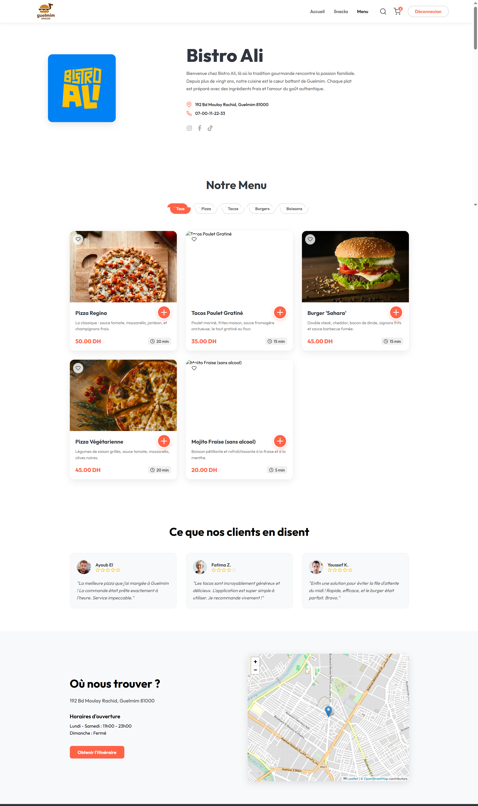
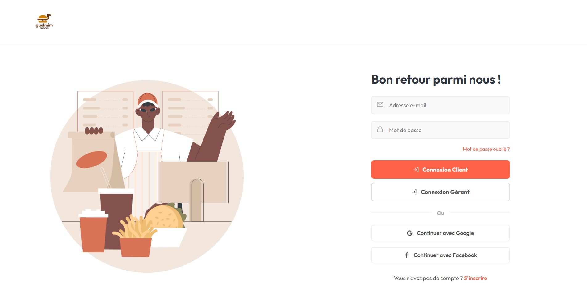
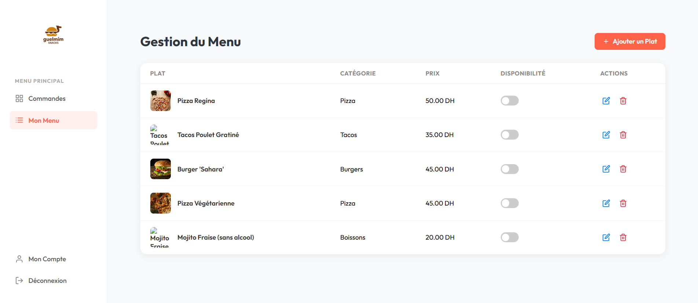

# 🚧 Guelmim Snacks (En Développement)

 

**Plateforme de Click & Collect en temps réel pour la restauration rapide.**

> ⚠️ **Note importante :** Ce projet est un prototype académique actuellement en cours de construction. Bien que les fonctionnalités principales (Front-end et API) soient fonctionnelles, l'intégration complète entre les deux parties est en cours de finalisation.

Guelmim Snacks est une application Full-Stack (SPA) conçue pour digitaliser et fluidifier le processus de commande entre les clients affamés et les snacks partenaires de la ville de Guelmim.

---

### 📅 État d'Avancement

- [x] **Maquettage & Design UI/UX :** Terminé
- [x] **Front-End (React) :** Fonctionnel (Navigation, Panier, Dashboard Gérant)
- [x] **Back-End (Laravel) :** API REST prête, Base de données & Seeders configurés
- [ ] **Intégration API :** En cours (Connexion React <-> Laravel)
- [ ] **Déploiement :** À venir

---

## 📸 Aperçu du Projet

### 🏠 L'Expérience Client
*Une interface moderne, fluide et responsive pour commander sans attente.*

| Page d'Accueil | Le Menu & Filtres |
|:---:|:---:|
|  |  |
| *Vitrine attractive avec CTA clairs* | *Filtrage dynamique par catégories* |

| Détail du Snack | Panier Interactif |
|:---:|:---:|
|  |  |
| *Présentation du restaurant et ses plats* | *Gestion des quantités en temps réel* |

---

### 👨‍🍳 L'Espace Gérant (Partenaire)
*Un tableau de bord puissant pour gérer le restaurant et le flux de commandes.*

#### 1. Authentification & Onboarding
Un système de connexion sécurisé et un assistant de configuration (Wizard) pour les nouveaux restaurants.

| Connexion Sécurisée | Configuration (Wizard) |
|:---:|:---:|
|  |  |

#### 2. Gestion des Commandes (Kanban)
Suivi en temps réel des commandes : **Nouvelles** -> **En Préparation** -> **Prêtes**.


#### 3. Gestion du Menu (CRUD)
Ajout, modification et suppression des plats via une interface intuitive.



---

## 🚀 Fonctionnalités Clés

### 👤 Pour les Clients
*   **Catalogue des Snacks :** Consultation de la liste des restaurants partenaires.
*   **Menu Détaillé :** Exploration des plats avec filtres par catégorie (Pizza, Tacos, etc.).
*   **Panier Interactif :** Gestion du panier en temps réel (ajout, modification de quantité, suppression).
*   **Expérience Fluide :** Navigation sans rechargement de page (Single Page Application).

### 👨‍🍳 Pour les Gérants (Partenaires)
*   **Inscription & Onboarding :** Processus d'inscription dédié et assistant de configuration du restaurant.
*   **Tableau de Bord "Kanban" :** Gestion des commandes en temps réel (Accepter -> En préparation -> Prête).
*   **Gestion du Menu (CRUD) :** Ajouter, modifier, supprimer ou masquer des plats facilement.
*   **Sécurité :** Espace protégé par authentification.

---

## 🛠️ Stack Technique

### Front-End (Client)
*   **Framework :** React.js (Vite)
*   **Routing :** React Router DOM v6 (Routes imbriquées & protégées)
*   **Gestion d'État (Démonstration académique) :**
    *   Version 1 : `useState` & Prop Drilling
    *   Version 2 : Redux Classique (Actions/Reducers)
    *   **Version 3 (Recommandée) :** Redux Toolkit (RTK)
*   **Styling :** CSS Modules (Design Responsive & Mobile First)

### Back-End (API)
*   **Framework :** Laravel 12
*   **Architecture :** API RESTful
*   **Base de Données :** MySQL
*   **Authentification :** Laravel Sanctum (Tokens API)
*   **ORM :** Eloquent (Relations & Seeders)

---

## 📦 Installation et Lancement

Ce projet est divisé en deux parties : le Backend (API) et le Frontend (React).

### 1. Pré-requis
*   Node.js & npm
*   PHP & Composer
*   MySQL

### 2. Installation du Backend (Laravel)

```bash
cd guelmim-snacks-backend

# Installer les dépendances PHP
composer install

# Configurer l'environnement
cp .env.example .env
# (Configurez votre base de données 'guelmim_snacks_db' dans le fichier .env)

# Générer la clé d'application
php artisan key:generate

# Créer les tables et injecter les données de test (Seeders)
php artisan migrate:fresh --seed

# Lancer le serveur API
php artisan serve

> L'API sera accessible sur `http://127.0.0.1:8000/api`

### 3. Installation du Frontend (React)

```bash
cd guelmim-snacks-frontend

# Installer les dépendances JS
npm install

# Lancer le serveur de développement
npm run dev
Voici le contenu **correctement structuré en Markdown**, prêt à être copié directement dans le fichier `README.md` de ton projet :

```md
## 🌐 Accès à l’API

L’API backend sera accessible à l’adresse suivante :

```

[http://127.0.0.1:8000/api](http://127.0.0.1:8000/api)

````

---

## ⚛️ Installation du Frontend (React)

```bash
cd guelmim-snacks-frontend

# Installer les dépendances JavaScript
npm install

# Lancer le serveur de développement
npm run dev
````

L’application sera accessible sur :

```
http://localhost:5173
```

---

## 🧪 Comptes de Démonstration (Seeders)

Pour tester immédiatement l’espace **gérant**, utilisez les identifiants suivants générés par les seeders :

* **Email** : `ali@gmail.com`
* **Mot de passe** : `password123`

---

## 📂 Architecture du Projet

Le projet respecte les principes de **séparation des préoccupations** :

### Frontend (React)

* Organisation par dossiers **feature-based**
* `pages/`
* `components/ui`
* `components/layout`
* `store/`

### Backend (Laravel)

* Architecture **MVC standard**
* Contrôleurs API dédiés :

  * `AuthController`
  * `RestaurantController`

---

## 🎓 Contexte du Projet

Projet réalisé dans le cadre du **projet de fin de module ReactJS** et du **module Laravel**.


## 👤 Auteur
**Abdelmajid El ainousi**  
[🌐 Mon Portfolio](https://elainousi-portfolio.vercel.app/) | [💼 Mon LinkedIn](https://www.linkedin.com/in/abdelmajid-el-ainousi/)

```
