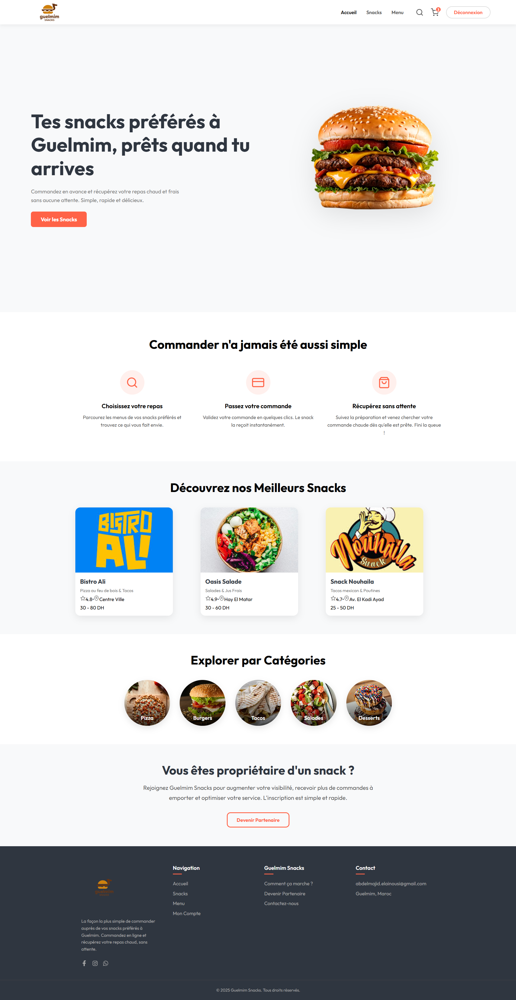
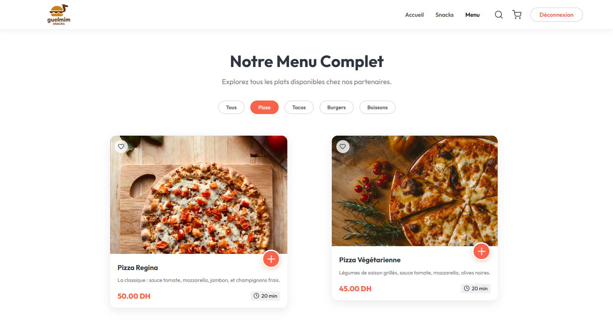
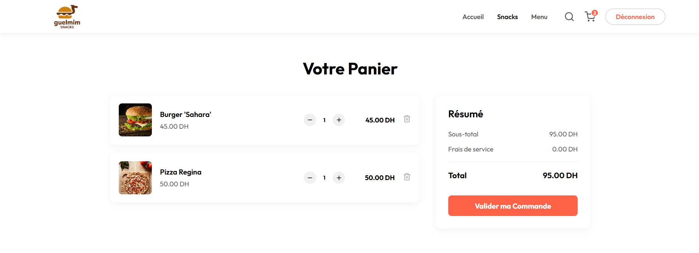
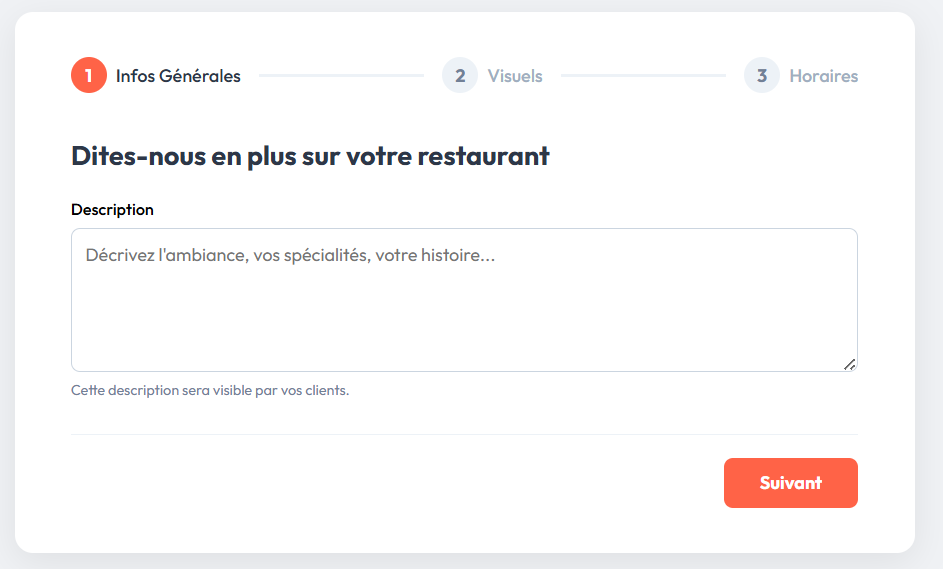
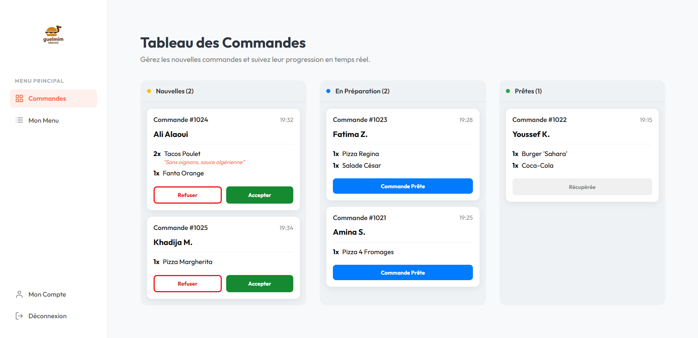

# 🚧 Guelmim Snacks (En Développement)

 

**Plateforme de Click & Collect en temps réel pour la restauration rapide.**

> ⚠️ **Note importante :** Ce projet est un prototype académique actuellement en cours de construction. Bien que les fonctionnalités principales (Front-end et API) soient fonctionnelles, l'intégration complète entre les deux parties est en cours de finalisation.

Guelmim Snacks est une application Full-Stack (SPA) conçue pour digitaliser et fluidifier le processus de commande entre les clients affamés et les snacks partenaires de la ville de Guelmim.

---

### 📅 État d'Avancement

- [x] **Maquettage & Design UI/UX :** Terminé
- [x] **Front-End (React) :** Fonctionnel (Navigation, Panier, Dashboard Gérant)
- [x] **Back-End (Laravel) :** API REST prête, Base de données & Seeders configurés
- [ ] **Intégration API :** En cours (Connexion React <-> Laravel)
- [ ] **Déploiement :** À venir

---

## 📸 Aperçu du Projet

### 🏠 L'Expérience Client

_Une interface moderne, fluide et responsive pour commander sans attente._

|                   Page d'Accueil                   |                 Le Menu & Filtres                  |
| :------------------------------------------------: | :------------------------------------------------: |
|  |  |
|        _Vitrine attractive avec CTA clairs_        |        _Filtrage dynamique par catégories_         |

|                   Détail du Snack                    |                 Panier Interactif                  |
| :--------------------------------------------------: | :------------------------------------------------: |
|  |  |
|      _Présentation du restaurant et ses plats_       |       _Gestion des quantités en temps réel_        |

---

### 👨‍🍳 L'Espace Gérant (Partenaire)

_Un tableau de bord puissant pour gérer le restaurant et le flux de commandes._

#### 1. Authentification & Onboarding

Un système de connexion sécurisé et un assistant de configuration (Wizard) pour les nouveaux restaurants.

|                 Connexion Sécurisée                  |                Configuration (Wizard)                 |
| :--------------------------------------------------: | :---------------------------------------------------: |
|  |  |

#### 2. Gestion des Commandes (Kanban)

Suivi en temps réel des commandes : **Nouvelles** -> **En Préparation** -> **Prêtes**.



#### 3. Gestion du Menu (CRUD)

Ajout, modification et suppression des plats via une interface intuitive.


---

## 🚀 Fonctionnalités Clés

### 👤 Pour les Clients

- **Catalogue des Snacks :** Consultation de la liste des restaurants partenaires.
- **Menu Détaillé :** Exploration des plats avec filtres par catégorie (Pizza, Tacos, etc.).
- **Panier Interactif :** Gestion du panier en temps réel (ajout, modification de quantité, suppression).
- **Expérience Fluide :** Navigation sans rechargement de page (Single Page Application).

### 👨‍🍳 Pour les Gérants (Partenaires)

- **Inscription & Onboarding :** Processus d'inscription dédié et assistant de configuration du restaurant.
- **Tableau de Bord "Kanban" :** Gestion des commandes en temps réel (Accepter -> En préparation -> Prête).
- **Gestion du Menu (CRUD) :** Ajouter, modifier, supprimer ou masquer des plats facilement.
- **Sécurité :** Espace protégé par authentification.

---

## 🛠️ Stack Technique

### Front-End (Client)

- **Framework :** React.js (Vite)
- **Routing :** React Router DOM v6 (Routes imbriquées & protégées)
- **Gestion d'État (Démonstration académique) :**

  - **Version 1 (Recommandée) :** Redux Toolkit (RTK)
  - Version 2 : Redux Classique (Actions/Reducers)
  - Version 3 : `useState` & Prop Drillingk# 🚧 Guelmim Snacks (En Développement)

 

Plateforme Click & Collect en temps réel pour la restauration rapide — prototype académique visant à digitaliser la prise de commandes pour les snacks locaux.

Résumé rapide : application Full‑Stack (React + Laravel) proposant une SPA client, un tableau de bord pour les gérants et une API REST.

---


## Installation rapide

Le projet contient deux dossiers : `backend` et `frontend`.

### 1. Pré-requis

- Node.js & npm
- PHP & Composer
- MySQL

### 2. Installation du backend (Laravel)

```bash
cd backend

# Installer les dépendances PHP
composer install

# Configurer l'environnement
cp .env.example .env
# (Configurez votre base de données 'guelmim_snacks_db' dans le fichier .env)

# Générer la clé d'application
php artisan key:generate

# Créer les tables et injecter les données de test (Seeders)
php artisan migrate:fresh --seed

# Lancer le serveur API
php artisan serve
```

L'API est disponible par défaut sur http://127.0.0.1:8000 (les routes API sont sous `/api`).


### 3. Installation du Frontend (React)

```bash
cd guelmim-snacks-frontend

# Installer les dépendances JavaScript
npm install

# Lancer le serveur de développement
npm run dev
````

Par défaut l'app React est accessible sur http://localhost:5173 (ou l'URL fournie par Vite).

**Remarque** : adaptez l'URL de l'API côté frontend (`.env` client ou configuration) si besoin.

---

## 🧪 Comptes de Démonstration (Seeders)

Pour tester immédiatement l’espace **gérant**, utilisez les identifiants suivants générés par les seeders :

- **Email** : `ali@gmail.com`
- **Mot de passe** : `password123`

---

## Architecture et organisation

- `frontend/` : code React (pages, components, store)
- `backend/` : API Laravel (controllers, models, migrations, seeders)

---

## 🎓 Contexte du Projet

Projet réalisé dans le cadre du **projet de fin de module ReactJS** et du **module Laravel**.

## 👤 Auteur

**Abdelmajid El ainousi**  
Développeur Full-Stack passionné par la création d'applications web modernes et performantes.

[🌐 Mon Portfolio](https://elainousi-portfolio.vercel.app/) | [💼 Mon LinkedIn](https://www.linkedin.com/in/abdelmajid-el-ainousi/)


